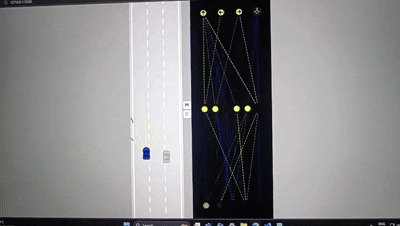

# 🏎️ Self-Driving Car Simulation (JS + Neural Networks)
<div></div>
<div align="center">


</div>

---

## 📌 Overview

A browser-based **self-driving car simulation** built using **plain JavaScript** and the HTML5 Canvas API.

- 🚗 Infinite road with traffic
- 🧠 Neural network visualizer in real-time
- 🔄 Models evolve with **mutations** each run
- 💾 Best model gets saved locally (localStorage)
- 🎮 You act as the **trainer** — refresh to improve generations!

---

## 🎯 How It Works

1. On first load, cars start with random neural networks.
2. Best-performing car is saved as the "model".
3. On reload, new cars spawn with **mutated versions** of the saved model.
4. Over generations, performance improves — a simple **evolutionary training loop**.

---

## 🌐 Live Demo

🔗 [**Try it on Vercel**](https://self-driving-car-js-sand.vercel.app/)

---

## 🛠️ Technologies Used

- **JavaScript (ES6)**
- **HTML5 Canvas API**
- **LocalStorage for persistence**
- **Custom-built Neural Network (no libraries!)**
- **Vercel for deployment**

---

## 🚀 Getting Started

```bash
# Clone repo
git clone https://github.com/your-username/Self-Driving-Car.git

# Open index.html in browser
```

---

## 📚 What I Learned

- Deep dive into JavaScript + OOP

- Basics of Neural Networks & Genetic Algorithms

- Data visualization using Canvas

- Browser-based simulation design

---

## 🎮 Your Role

- Drive evolution by reloading the page
- Watch the neural net learn traffic patterns
- Experiment with training different generations

---

## 📸 Screenshots
